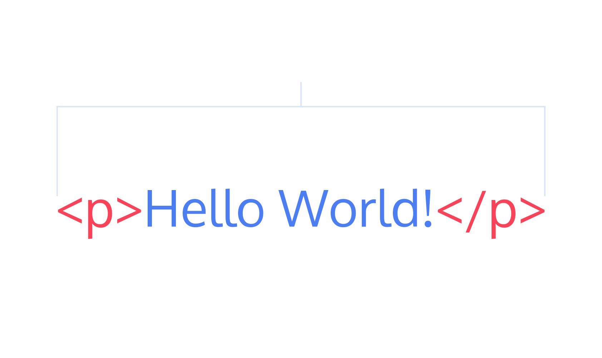

HTML Anatomy
============

HTML is composed of *elements*. These elements structure the webpage and define its content. Let's take a look at how they're written.

The diagram displays an HTML paragraph element. As we can see, the paragraph element is made up of:

-   An *opening tag* (`
`)
-   The content ("Hello World!" text)
-   A *closing tag* (`
`)

A *tag* and the *content* between it is called an HTML element. There are many tags that we can use to organize and display text and other types of content, like images.

Let's quickly review each part of the element pictured:

-   HTML element (or simply, element) --- a unit of content in an HTML document formed by HTML tags and the text or media it contains.

-   HTML Tag --- the element name, surrounded by an opening (`<`) and closing (`>`) angle bracket.

-   Opening Tag --- the first HTML tag used to start an HTML element. The tag type is surrounded by opening and closing angle brackets.

-   Content --- The information (text or other elements) contained between the opening and closing tags of an HTML element.

-   Closing tag --- the second HTML tag used to end an HTML element. Closing tags have a forward slash (`/`) inside of them, directly after the left angle bracket.

# Instructions

Study the diagram to learn about the anatomy of HTML syntax. When you're done, continue to the next exercise.